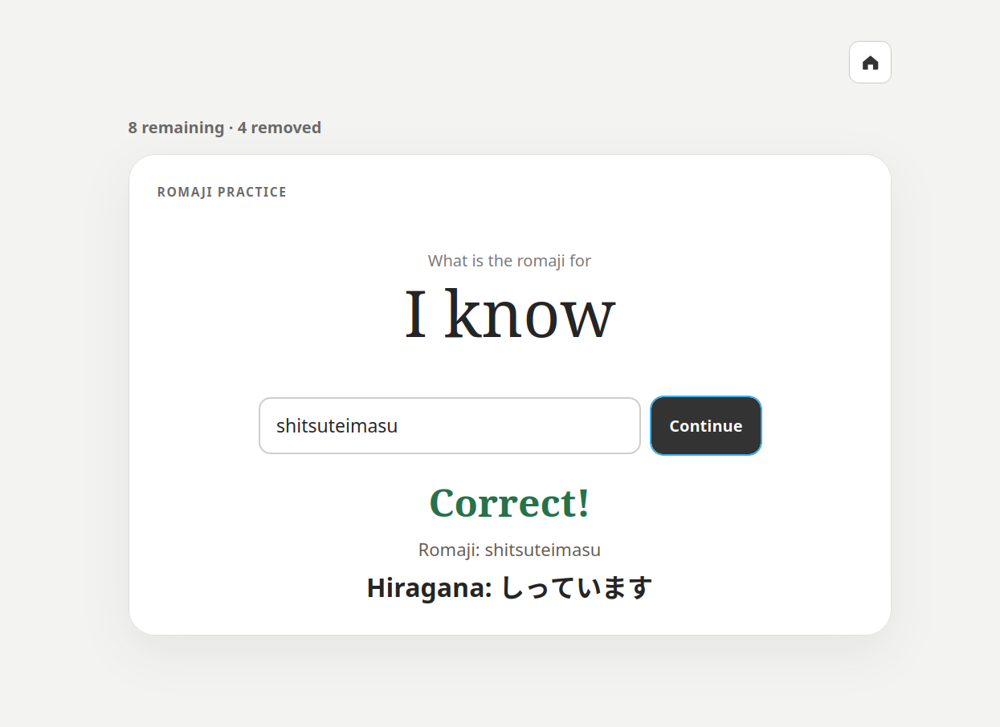
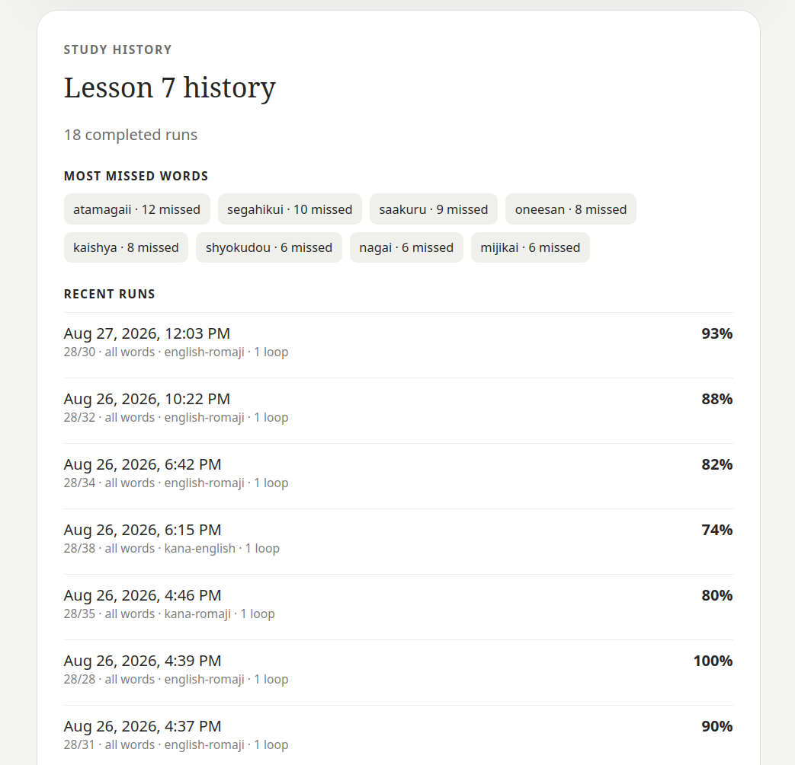
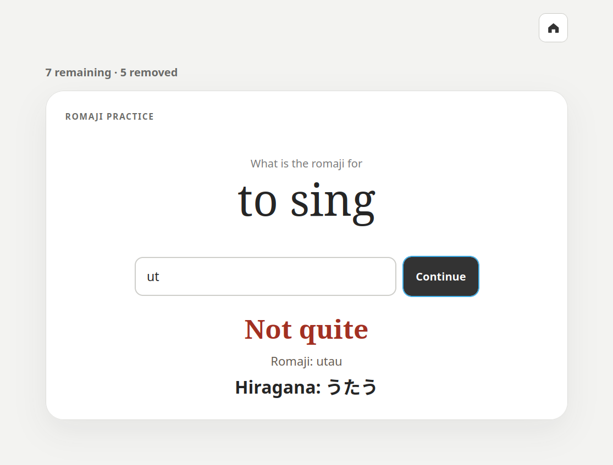

# Kotoba Cards

A lightweight Japanese flashcard web app powered by Python.

## Features

- Study Hiragana → English, Hiragana → Romaji, or English → Romaji.
- Choose removal, fixed-loop, or introduction mode.
- Practice every word or focus on your most-missed words.
- Set 1–5 loops, shuffle cards, and enable progressive hints.
- Review each word's right/wrong ratio, accuracy, and recent runs in study history.

Press `Enter` to check an answer or continue. Press `Ctrl+H` for a hint when
hints are enabled.

## Screenshots

| Practice and feedback | Study history |
| --- | --- |
|  |  |



## Run

```bash
python app.py
```

Open <http://127.0.0.1:8001>.

## Add lessons

Create files such as `lesson8.csv` beside `app.py` using this format:

```csv
inu,dog,いぬ
neko,cat,ねこ
```

Lessons appear automatically after a refresh.

## Study history

Progress is stored in the Git-ignored `history.json`. The app creates it after
your first session. For sample data, run:

```bash
cp history.example.json history.json
```

Older history remains compatible. All guesses in an older word record are
treated as right, with zero wrong guesses, until new results are recorded.
