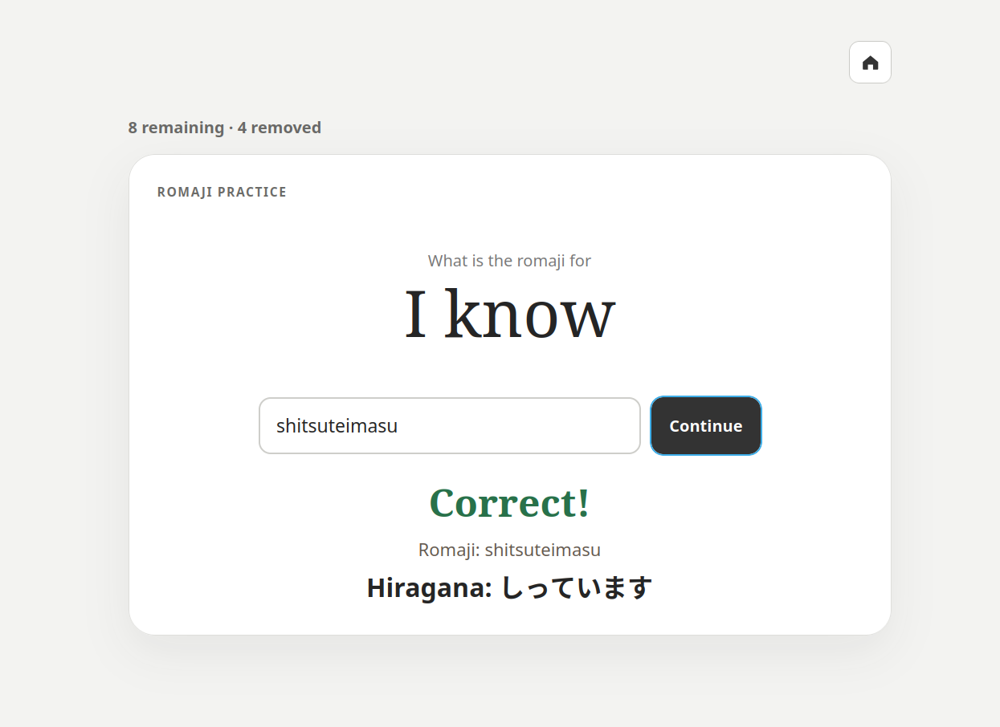
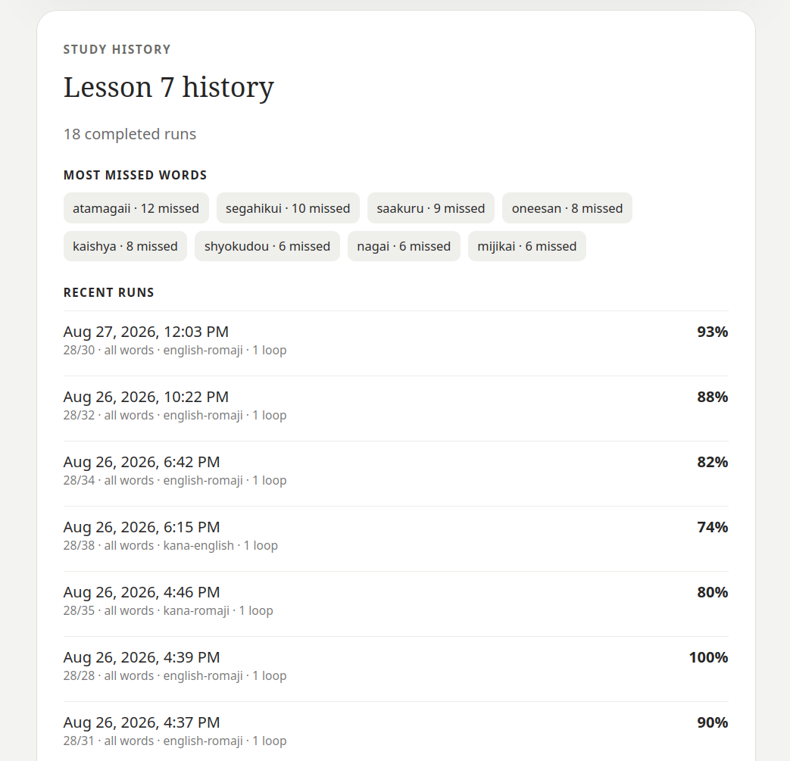
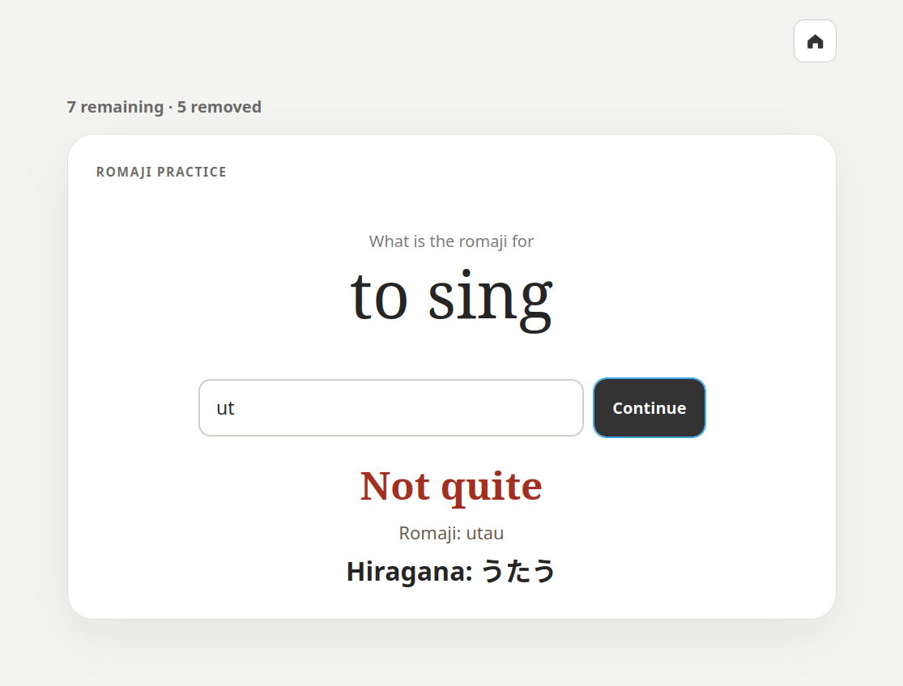

# Kotoba Cards

A lightweight Japanese flashcard web app powered by Python.

## Features

- **Lesson 9 Vocabulary** contains the 26 supplied JSON words. **Lesson 9 Katakana**
  contains seven words with katakana and English shown; answer in romaji. Long
  vowels accept macrons or expanded spellings, such as `mēru` / `meeru`.

- Practice **Lesson 7 Sentences** with token scores, colored Japanese feedback,
  English explanations, verb dictionary forms and conjugation breakdowns, progressive hints, and immediate retries with hints enabled.
- Practice **Lesson 8 Sentences** with 21 cards from the grammar review sheet:
  informal questions and negative answers, thoughts, negative requests, reported
  speech, and personal answers about drawing, sports, the gym, and driving.
- Study **Lesson 8-1** vocabulary or its **Lesson 8-1 Katakana** subset.
  Katakana words reveal their katakana spelling after checking an answer.
- Study **Lesson 8-2** for 28 more vocabulary entries, with romaji, English,
  and hiragana readings.
- Study Hiragana → English, Hiragana → Romaji, English → Romaji, or English → Hiragana.
- Select **Learn Katakana** for the 46 basic katakana characters, answered in romaji.
- Select **Learn Kanji** for a separate lesson of 14 single kanji characters.
  Guess any listed reading in romaji using one answer field.
- Select **Lesson 5 Kanji** for 14 kanji, from 山 (mountain) to 飲 (to drink).
  It defaults to separate reading boxes, like Lesson 4. Enter `ta` and `da`
  in separate boxes for 田, in either order.
- Select **Lesson 6 Kanji** for 15 kanji, from 東 (east) to 国 (country),
  with the same question directions and separate reading boxes as Lesson 5.
- Choose **Kanji → Romaji (one reading)** to guess one listed reading of a kanji
  or the full reading of a kanji word. Select Lesson 4 or Lesson 4-2 to try it.
- Practice kanji-to-romaji readings in any order with up to three separate
  answer fields.
- Practice kanji meanings in English; cards with multiple listed meanings
  accept any one of them.
- Choose removal, fixed-loop, or introduction mode.
- Choose **Most wrong cards (top 10)** in **Study mode** to practice the
  selected lesson’s most frequently missed cards with removal after correct answers.
- Practice every word or focus on your most-missed words.
- Choose **Cards I got wrong** under **Word set** to review every card you
  answered incorrectly in completed runs of the selected lesson.
- Set 1–5 loops, shuffle cards, and enable progressive hints.
- Review each word's right/wrong ratio, accuracy, and recent runs in study history.
- Refresh to return to the home screen with your dropdown selections preserved.
  The browser remembers question direction per lesson; active card progress resets.

Press `Enter` to check an answer or continue. Press `Ctrl+H` for a hint when
hints are enabled. In kanji practice, use the arrow keys to move between
reading fields. With hints enabled, press `Enter` after an incorrect kanji
answer to see the next card in the deck, then retry the missed kanji, just like
other vocabulary cards. If only one card remains, it repeats immediately.
With hints off, it returns later.

## Screenshots

| Practice and feedback | Study history |
| --- | --- |
|  |  |



## Run

```bash
python app.py
```

Open <http://127.0.0.1:8001>.

## Add lessons

Create files such as `lesson8.csv` beside `app.py` using this format:

```csv
inu,dog,いぬ
neko,cat,ねこ
```

Lessons appear automatically after a refresh.

Kanji-reading lessons use `kanji` in the fourth CSV column. Separate multiple
hiragana readings with `|`:

```csv
日,day / sun,に|にち|び,kanji
本,book / origin,ほん,kanji
```

The `kanji` marker makes the card show the kanji and ask for all readings in romaji.
Regular three-column lessons continue to use romaji, English, and hiragana as
shown above.

Compound-kanji lessons use the `kanji-word` marker and ask for one complete
word reading. They support kanji-to-romaji, kanji-to-hiragana, and
English-to-romaji practice. English-to-romaji feedback also reveals the full
kanji spelling below the reading:

```csv
日本,Japan,にほん,kanji-word
日曜日,Sunday,にちようび,kanji-word
```

## Study history

Progress is stored in the Git-ignored `history.json`. The app creates it after
your first session. For sample data, run:

```bash
cp history.example.json history.json
```

Older history remains compatible. All guesses in an older word record are
treated as right, with zero wrong guesses, until new results are recorded.

## Mobile / Vercel

The same app adapts to phone screens with large touch controls and compact
sentence feedback. Vercel serves a static build with every lesson included.
Study history is saved in that browser's local storage; it does not sync between
devices or import your desktop history. Clearing site data removes that progress.
The Python app continues to use `history.json`.

Build and preview the hosted version locally:

```bash
python3 scripts/build_static.py
python3 -m http.server 8002 --directory dist
```

Open <http://localhost:8002>. Import this repository in Vercel using the Other
framework preset; `vercel.json` supplies the build command and `dist` output
folder. No database, environment variables, or Python server is required at
runtime. Only static assets and lesson JSON are exported; personal study history
is excluded. Rebuild after editing lesson CSV files.
